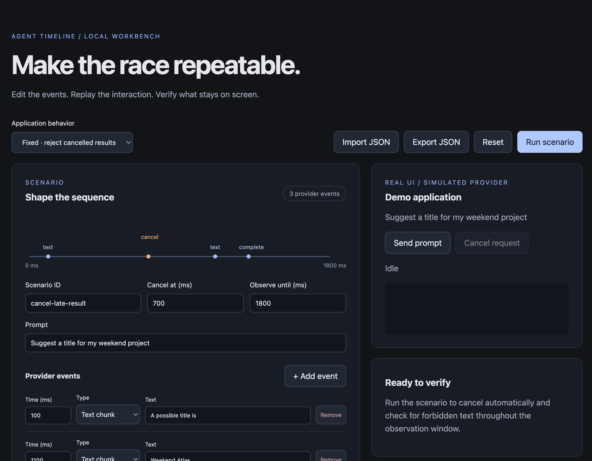
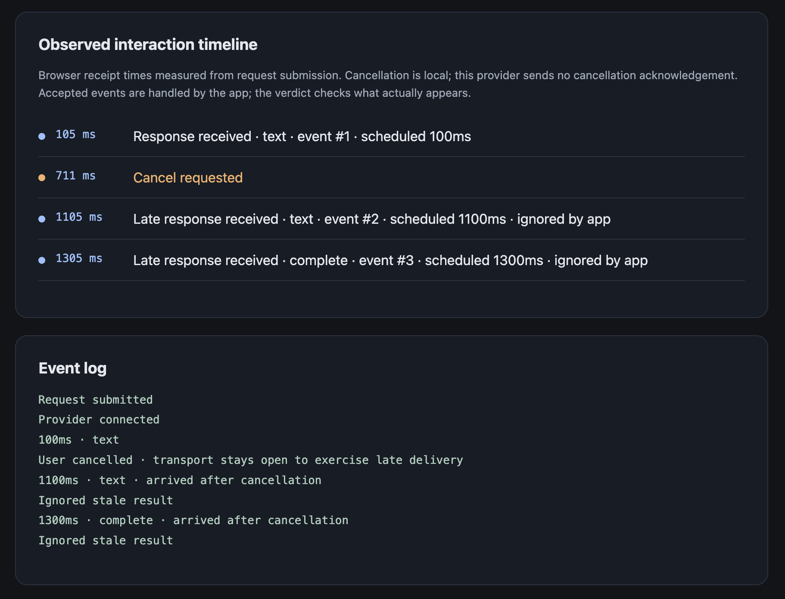

# Agent Timeline

Reproduce the exact moment your AI interface breaks, then turn it into a regression test.

Agent Timeline is an open-source project for reproducing timing bugs in AI interfaces: streaming responses, cancellations, retries, and delayed results.

The local workbench includes an editable event timeline, a streaming provider, automatic cancellation replay, and pass/fail assertions against a real demo chat. A reusable TypeScript client connects to the simulated provider; external-app UI automation is not implemented yet.



*Edit event timing, replay AI interactions, and catch late responses after cancellation.*

## Run locally

Requires Node.js 22.12 or newer.

```bash
npm install
npm run dev
```

Open http://127.0.0.1:4317. `npm run dev` starts two separate processes: Vite on port 4317 and the provider on port 4318. Stopping the combined command stops both.

Run either independently with `npm run dev:frontend` or `npm run dev:backend`. The frontend proxies `/api` to the backend; a provider-only consumer connects directly to `http://127.0.0.1:4318/api/generate`. Set `TIMELINE_PROVIDER_PORT` consistently in both processes to change the backend port. Build the frontend with `npm run build:frontend` (output: `dist/frontend`); hosting that build requires an API proxy or equivalent routing.

```text
frontend/  React workbench, gallery, and Vite configuration
backend/   HTTP provider; no React or Vite imports
shared/    Scenario types, validation, and replay engine
client/    Framework-independent streaming connection
```

Dependencies remain managed by one root package and lockfile; the processes and code boundaries are separated, not independently published packages.

1. Choose **Buggy** or **Fixed** application behavior.
2. Edit event times, text chunks, completion or error events, and cancellation timing.
3. Set the observation window and the text that must stay absent after cancellation.
4. Click **Run scenario**. The workbench submits the request, clicks the real cancel control, and observes the rendered response.
5. Read the pass/fail verdict and event log. A failed run highlights the last delivered provider event associated with the first observed violation; this is an attribution aid, not proof of root cause.
6. Export JSON to save the scenario, or import a saved file to replay it.

Events must be ordered, finish with one completion or error event, and fit inside the observation window. Use **Sort events by time** after retiming. Invalid scenarios cannot run or export. Edits stay in memory until exported; refreshing reloads the default fixture. Reset stops outstanding timers, observers, and delivery while retaining the edited scenario.

**Send prompt** and **Cancel request** remain available for manual exploration. Only **Run scenario** generates a workbench verdict.

## Observed interaction timeline

The observed interaction timeline records **Cancel requested** and **Late response received**, including whether the app accepted or ignored each late event. These browser timestamps start at request submission; scheduled provider offsets remain separate. This provider does not acknowledge cancellation.

Cancellation deliberately leaves the stream open to model a result that arrives after the user cancels. Fixed mode rejects the stale request ID; buggy mode displays it. This demonstrates client-side result handling, not cancellation of a remote side effect.



*Cancellation requested at 711 ms; late responses at 1105 ms and 1305 ms were ignored by the app.*

## Verify the failure and fix

```bash
npx playwright install chromium
npm run verify
npm run verify:fixed
npm run verify:buggy
```

`npm run verify` is the readiness check: it runs both commands below and stops on failure.

- `npm run verify:backend`: backend/client type checks, engine/client unit tests, and direct HTTP provider tests. Starts only the backend on port 4428; no frontend or browser is required.
- `npm run verify:frontend`: frontend type checks, production build, and browser tests. Starts a fresh frontend on port 4417 and its provider on port 4418.

Verification owns these temporary servers and shuts them down afterward. Reserved ports must be free; verification never reuses a running development server. Install Playwright Chromium before frontend verification. `npm run check` remains available as the earlier development check and does not build the frontend.

`check` validates TypeScript, the engine, and browser behavior, including confirming that the buggy demo exposes the known defect. `verify:fixed` exits successfully. `verify:buggy` intentionally exits with failure because it enforces the same no-late-results invariant on the buggy app.

Both automatic workbench runs and browser tests observe response mutations across the observation window, rather than checking only the final screen. A provider failure to start or an incomplete delivery produces a run error instead of a passing verdict. PASS applies only to the configured text-absence assertion, not overall application correctness. Reset aborts pending delivery and starts a fresh run. The demo has no persistence layer yet.

## Current boundaries

Scenarios supply the prompt, provider events, cancellation delay, observation duration, and assertion. Workbench replay currently controls the built-in demo only. Browser actions in headless verification remain demo-specific, not a general action registry. The CLI reads the default scenario file; exported files can be imported in the workbench or used to replace that fixture. Tests wait for the provider-start acknowledgement before timing cancellation; browser timing is approximate, while provider offsets are measured from request receipt. The server binds to loopback and is development-only. No API keys or live models are needed.

## Design

Simulate AI provider responses while the application’s real rendering, state, and persistence run. Control event timing, replay failures, and verify expected behavior with assertions.

- [Progress and next steps](PROGRESS.md)
- [Provider connection](docs/PROVIDER.md)
- [Scenario reference](docs/SCENARIOS.md)
- [Implementation scope](docs/MVP.md)
- [Architecture specification](docs/ARCHITECTURE.md)

## Credits

A project by Visuail LLC. Engineering: Kate Steinmeyer.

## License

Licensed under the [MIT License](LICENSE).

## Scenario gallery

Open **Explore seven more race scenarios** in the workbench, or visit `http://127.0.0.1:4317/?gallery`.

Choose a scenario and run it in **Buggy** mode to reproduce the defect, then **Fixed** mode to verify the correction:

| Scenario | Assertion |
| --- | --- |
| Requests finish out of order | Only the newest result appears. |
| Cancel then retry | Cancelled chunks never mix into the retry. |
| Stream fails halfway through | Partial text remains, loading ends with an error, and retry succeeds. |
| Navigate away and return | Invalidated results never appear on return. |
| Delete during generation | A late result never recreates the deleted item. |
| Change inputs during generation | A response based on the previous brief is rejected. |
| Duplicate delivery | Repeated delivery of the same event ID appends text once. |

The gallery runs real React editor state and browser controls against the local streaming provider. It checks forbidden content throughout replay, expected final content, provider completion, and an intermediate error-state assertion before retry. Browser scheduling remains approximate; incomplete delivery is a run error rather than a pass.

Gallery recipes live in `frontend/raceScenarios.ts` and are covered by `tests/gallery.spec.ts` (`npm test`). They use multiple requests and app actions, so they are separate from the editable workbench's version-1 JSON format. Gallery import/export, arbitrary host integration, and persistent navigation state are not implemented. The navigation example changes views inside the demo; it does not reload the page.
